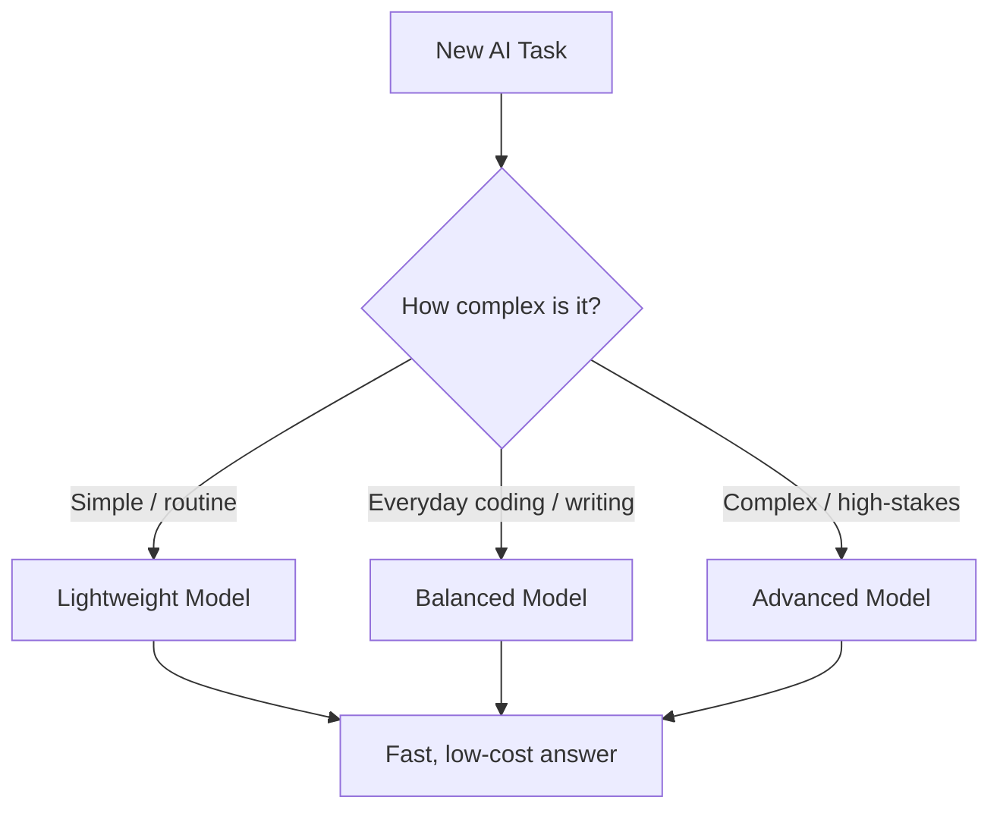
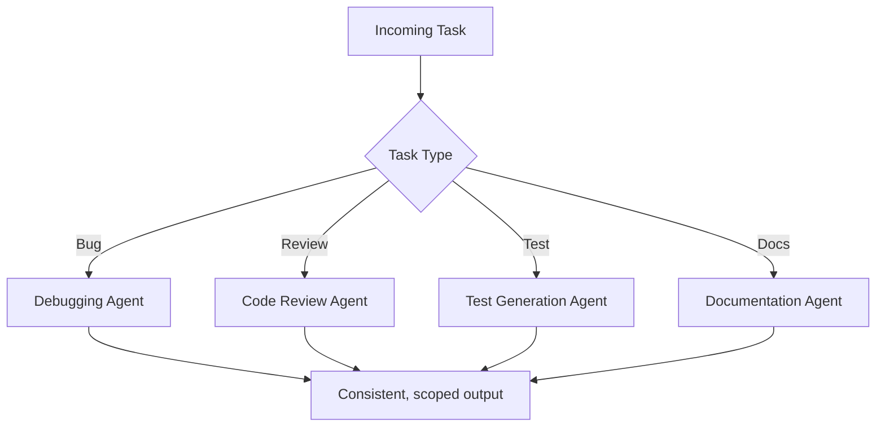

# Part 2 — Practical ways for AI Token Optimization Techniques

---

## 1. AI Token Optimization for Non-Technical Users
You don't need technical knowledge to save AI tokens. Most unnecessary usage comes from simple everyday habits. By making requests clearer and avoiding repeated work, users can get the same results with fewer interactions.

### 1.1 Ask Focused Questions

A clear question helps AI understand exactly what you need. When a request is vague or contains too much unrelated information, AI may provide a broad answer that does not solve the actual problem. This often leads to additional follow-up questions and more AI usage.

Try to mention the **actual task, important details, and expected result** instead of explaining the entire background.

**Less efficient:**

> I am working on a report and I'm not sure how to write this section. I have already written some parts and discussed it with my team, but I don't know whether this section should be long or short. Can you help me?

**Better:**

> Write a short introduction for a report on AI token optimization.

The second request gives AI a clear task and reduces unnecessary discussion.

---

### 1.2 Avoid Unnecessary Follow-Ups

Before asking another question, check whether the previous response already contains the information you need. Sometimes users ask several follow-up questions simply because they did not read the complete response.

If something is missing, ask specifically for the missing part instead of asking AI to explain the entire topic again.

**Less efficient:**

> What are the benefits of this method?

Then:

> Can you explain the benefits again?

**Better:**

> Explain the three main benefits in simple language.

This keeps the conversation focused and avoids repeating information that has already been generated.

---

### 1.3 Ask for the Required Length

AI often provides more information than necessary when no response length is specified. If you only need a quick answer, clearly mention the expected size.

This is especially useful for emails, summaries, definitions, reports, and simple explanations. Asking for the required length also makes the response easier to read.

**Less efficient:**

> Explain AI agents.

**Better:**

> Explain AI agents in 3 bullet points.

Other useful instructions include:

* "Answer in one paragraph."
* "Keep it under 100 words."
* "Give only 5 points."
* "Explain it in simple language."

---

### 1.4 Combine Related Requests

When several questions are closely related, they can often be included in one well-structured request. Sending each question separately can create unnecessary interactions, especially when all of them are part of the same task.

Combining related requirements also gives AI a better understanding of the complete goal.

**Less efficient:**

> What is an AI agent?

> How does it work?

> Where is it useful?

**Better:**

> Explain what an AI agent is, how it works, and give two practical use cases.

However, unrelated tasks should not be combined just to reduce the number of messages. Keeping unrelated tasks separate can make the conversation clearer.

---

### 1.5 Start Fresh When the Topic Changes

A conversation that contains useful information for one task may not be useful for another. If you move from one completely different topic to another, starting a fresh conversation can keep the new task focused.

For example, if a conversation contains a long discussion about writing a report and you now want to debug Python code, the previous report discussion may no longer be relevant.

**Example:**

> Report discussion → Finish the conversation.

> New Python debugging task → Start a new conversation.

The purpose is not to create a new chat for every small question. Start fresh when the previous conversation is no longer relevant to the task.

---

### 1.6 Remove Unnecessary Information

AI does not need to know every detail about a situation. Include information that can actually change the answer and remove unrelated background.

A useful question to ask before sending a prompt is:

> "Does AI need this information to answer my question?"

If the answer is no, it can usually be removed.

**Less efficient:**

> I have been working on this project for several weeks, and after discussing it with my team, we decided that we should improve the documentation. I have already written several sections...

**Better:**

> Rewrite this project description in simple English.

This makes the request shorter and keeps AI focused on the actual task.

---

### 1.7 Reuse Good Prompts

If you regularly perform the same type of task, there is no need to create a completely new request every time. Save prompts that consistently produce useful results and reuse them.

This is particularly helpful for repeated work such as meeting summaries, email writing, code reviews, documentation, and testing.

**Example:**

> Summarize these meeting notes into: Decisions, Action Items, Owners, and Deadlines. Keep each point short.

The same prompt can be reused for future meetings by replacing only the meeting notes.

Teams can also keep frequently used prompts in a shared document or prompt library.

---

### 1.8 Summarize Long Conversations

Long conversations can become difficult to manage because they contain many previous questions, answers, corrections, and decisions. Instead of continuing the same discussion indefinitely, ask AI to create a short summary of the useful information.

The summary can then be used as a reference for the next stage of the task.

**Example:**

> Summarize the key decisions, requirements, and pending tasks from this conversation in 5 bullet points.

After getting the summary, users can continue with the important information instead of repeatedly referring to the entire discussion.

---

### 1.9 Choose the Right Model

Not every task requires the most powerful AI model. Simple tasks can usually be handled by a lightweight or faster model, while tasks requiring deeper reasoning may need an advanced model.

Choosing the appropriate model prevents users from using a high-capability model for work that does not require it.

**Example:**

| Task                   | Suitable Model Level |
| ---------------------- | -------------------- |
| Grammar correction     | Lightweight          |
| Simple summary         | Lightweight          |
| Email rewriting        | Lightweight          |
| Simple code generation | Lightweight / Medium |
| Complex debugging      | Advanced             |
| Architecture planning  | Advanced             |

The goal is not always to choose the cheapest model. The goal is to use a model that is **sufficient for the task**.

---

### 1.10 Specify the Output Format

Sometimes the AI response is useful but not in the format the user needs. The user then has to send another request to change the format.

This can be avoided by specifying the expected format in the first request.

**Example:**

> Explain the process as a 5-step checklist.

or:

> Compare these tools in a table with columns for Cost, Features, and Best Use.

or:

> Give only the final SQL query.

Clearly defining the output format helps AI produce a usable answer on the first attempt.

---

### 1.11 Be Clear Instead of Making AI Guess

When the user knows what they want, they should state it directly. Words such as "make it better," "fix this," or "improve it" can have many possible meanings.

A more specific instruction gives AI a clear target and reduces the chance of multiple attempts.

**Less efficient:**

> Make this better.

**Better:**

> Make this paragraph shorter and more professional while keeping the original meaning.

The second request tells AI exactly what needs to change and what should remain unchanged.

---

### 1.12 Avoid Unnecessary Regeneration

If only one part of an AI response needs to be changed, there is usually no need to regenerate the entire response.

For example, if the conclusion of a report is good but the introduction is too long, asking AI to rewrite the entire report creates unnecessary output.

**Less efficient:**

> Rewrite the entire answer.

**Better:**

> Change only the introduction and keep the remaining sections unchanged.

This approach is useful when editing reports, emails, code, documentation, and other large outputs.

---

### 1.13 Give Useful Feedback Instead of Saying "Try Again"

When an answer is not correct, simply saying "try again" does not tell AI what needs to change. The next response may make the same mistake.

Instead, explain the specific problem with the previous answer.

**Less efficient:**

> Try again.

**Better:**

> The answer is correct, but it is too detailed. Keep the same points and reduce the explanation to 5 bullet points.

This gives AI useful direction and reduces repeated attempts.

---

### 1.14 Reuse Useful AI Outputs

Good AI responses do not have to be used only once. If AI creates a useful template, checklist, prompt, code pattern, or explanation, save it for future work.

For example, a developer who receives a useful debugging prompt can save it as a personal shortcut instead of creating a new debugging prompt every time.

Useful outputs can be saved as:

* Personal prompt templates
* Team templates
* Documentation examples
* Code snippets
* Checklists
* Internal guides

This turns previous AI work into a reusable resource.

---

### 1.15 Ask for Only the Explanation You Need

AI explanations can become unnecessarily long when the user asks for both a solution and a detailed explanation.

If the user already understands the basics, asking for a short explanation is usually enough.

**Less efficient:**

> Give me the code and explain every line in detail.

**Better:**

> Give me the corrected code and explain only the important change.

This is particularly useful for experienced developers who need the solution quickly but still want to understand the main reason behind the change.

---

### 1.16 Know When AI Is Not Necessary

AI does not need to be involved in every task. If a task can be completed faster manually, sending an AI request may not provide any real benefit.

Examples include:

* Simple copy-and-paste work
* Very small formatting changes
* Running a command that is already known
* Looking up information already available in a trusted internal document
* Repeating a simple routine action

AI should be used when it **saves time, improves the result, or helps with reasoning**. Avoiding unnecessary AI usage is also a form of token optimization.

---

## 2. AI Token Optimization for Developers

Developers often use AI many times during the day for coding, debugging, testing, documentation, SQL, and API work. The goal is not to reduce AI usage completely, but to make each request more useful.

A common problem is asking AI to do too much, giving unclear instructions, or requesting information that is not actually needed. A more specific request helps AI understand the task faster and reduces the need for repeated corrections and follow-up requests.

The following techniques can be applied directly to common development tasks.

### 2.1 Debugging

Debugging is one of the most common uses of AI for developers. A vague debugging request forces AI to guess what is wrong, which can lead to several possible solutions and additional questions.
A better approach is to clearly state the **expected behavior, actual behavior, error message, and required result**. This gives AI enough information to focus on the actual problem.

**Bad Prompt:**

> My Python code is not working. Please fix it.

**Better Prompt:**

> Fix this Python function.
> Expected: return the user's full name.
> Actual: returns `None`.
> Error: `AttributeError`.
> Provide the corrected function and a short explanation.

The better request gives AI a clear problem and a defined output. It also tells AI not to provide an unnecessarily long explanation.

---

### 2.2 Code Generation

AI can generate anything from a small function to a complete application. However, asking for a large amount of code when only a small component is required can result in unnecessary output.
A better approach is to describe the **specific component or functionality** you need. Once that part works, additional functionality can be requested if required.

**Bad Prompt:**

> Build a complete authentication system for my application.

**Better Prompt:**

> Create a Python function that validates an email and password before login. Return `True` for valid input and `False` otherwise.

The second request has a clear scope and produces only the required functionality.

---

### 2.3 Refactoring

Refactoring usually means improving existing code without changing what it does. If the request simply says "improve this code," AI may make unnecessary changes to the logic, structure, naming, or behavior.
A better prompt should clearly state **what should be improved and what must remain unchanged**.

**Bad Prompt:**

> Improve this code.

**Better Prompt:**

> Refactor this Python function to improve readability. Keep the current behavior and function signature unchanged. Return only the updated function.

This tells AI exactly what to change and what not to change. It also limits the response to the code that is actually required.

* Keep the existing behavior.
* Do not change the function signature.
* Do not add new dependencies.
* Return only the changed code.

---

### 2.4 Code Review

Code review can cover many areas, including bugs, security, performance, readability, error handling, and maintainability. Asking AI to "review my code" without specifying the purpose can produce a long response covering issues that are not relevant to the current task.
Instead, identify the specific areas that need to be checked.

**Bad Prompt:**

> Review my code.

**Better Prompt:**

> Review this Python function for security and error-handling problems. List only issues that require action.

The better request narrows the review to the areas that matter. This makes the output easier to understand and avoids unnecessary suggestions.

Examples:

> Check only for security issues.

> Check for performance problems.

> Check for possible bugs and edge cases.

> Check whether the code follows our coding standards.

---

### 2.5 Unit Testing

AI can generate a large number of tests if the request is too general. Some of these tests may cover situations that are not important for the current feature.
Instead, specify the **behaviors and scenarios that need to be tested**.

**Bad Prompt:**

> Write tests for this code.

**Better Prompt:**

> Write pytest tests for successful login, invalid password, missing email, and expired session. Return only the test code.

The better request defines the exact scenarios and the required output format.
For example:

* Normal/success case
* Invalid input
* Missing input
* Boundary case
* Expected error

This produces more focused tests and avoids generating large numbers of unnecessary cases.

---

### 2.6 Documentation

Documentation requests can easily become much larger than necessary. If a developer only needs a function description, asking AI to explain the entire project can produce a large amount of unnecessary text.
The request should match the level of documentation actually required.

**Bad Prompt:**

> Explain this entire project and write detailed documentation.

**Better Prompt:**

> Write a short docstring for this function describing its purpose, parameters, and return value.

The second request produces only the documentation required for the function.

Examples:

> Write a one-line docstring.

> Create a short README section.

> Explain this API endpoint in 5 bullet points.

> Generate Python docstrings for these functions.

This prevents AI from producing more documentation than necessary.

---

### 2.7 SQL Work

SQL requests can often be made very specific because the expected result is usually well-defined. A vague request such as "fix my SQL query" does not tell AI what the query should return.
Provide the **database type, required result, important conditions, and output format**.

**Bad Prompt:**

> Fix my SQL query.

**Better Prompt:**

> PostgreSQL: return the top 10 customers by total order value for 2026. Group by customer and sort by total descending. Provide only the query.

The better request defines the database, result, filtering requirement, sorting, and expected output.
Such as :
* Database type
* Tables involved
* Expected result
* Filters
* Sorting
* Grouping
* Required output format

---

### 2.8 API Work

API-related tasks can involve many different things, such as creating requests, handling authentication, processing responses, debugging errors, or writing integrations. A general request like "help me with this API" does not provide enough direction.
Instead, specify the **HTTP method, endpoint, input data, expected response, and programming language** when relevant.

**Bad Prompt:**

> Help me with this API.

**Better Prompt:**

> Create a Python `requests` example for a `POST /users` endpoint. Send `name` and `email` as JSON and print the response status.

The better request clearly defines the required operation and output.

For example:

> Create a Python example for a `GET /users/{id}` endpoint. Print the returned user's name.

This is more focused than asking AI to explain the entire API.

---

### 2.9 Ask for Only the Required Code

Developers often need only a small change, but AI may return an entire file or a long explanation. If the task is small, specify exactly what should be returned.

**Bad Prompt:**

> Fix this function and explain everything you changed in detail.

**Better Prompt:**

> Fix the function and return only the corrected code with a two-line explanation.

This keeps the response focused and makes it easier to review.

---

### 2.10 Avoid Repeating the Same Correction

If AI generates code that is almost correct, avoid starting the request again from the beginning. Tell AI exactly what is wrong with the previous result.

**Less efficient:**

> This doesn't work. Try again.

**Better:**

> The solution works, but it changes the existing function signature. Keep the signature unchanged and provide only the corrected function.

The second request gives AI useful feedback and makes the next response more likely to match the requirement.

---

### 2.11 Use AI for the Right Level of Work

Not every development task requires an advanced model or a long AI conversation.

For example, a simple function, basic SQL query, or small documentation task may not require the same level of reasoning as a complex debugging problem or architecture decision.

A developer should first ask:

> "How difficult is this task?"

Then choose the appropriate model and amount of AI assistance.

**Example:**

| Development Task      | Suitable AI Level    |
| --------------------- | -------------------- |
| Simple function       | Lightweight          |
| Basic SQL query       | Lightweight          |
| Simple unit test      | Lightweight          |
| Code explanation      | Lightweight / Medium |
| Complex debugging     | Advanced             |
| Large refactoring     | Advanced             |
| Architecture decision | Advanced             |

This keeps advanced AI capabilities available for tasks where they provide real value.

---

## 3. Choosing the Right AI Model

Every platform offers more than one model tier, and most people default to whichever one loaded first — usually the most capable, and usually the most expensive. That's the wrong default for most day-to-day work.

**The rule is simple:**
- **Simple, well-defined task → lightweight model.**
- **Complex, ambiguous, or high-stakes task → advanced model.**

A lightweight model handling a boilerplate request gets the same correct answer as a premium model would — there's no quality trade-off for tasks that don't need deep reasoning. The savings come from not paying premium-model cost for work that never needed it.

### Current model tiers 

**1. Claude (Anthropic)**

| Model | Tier | Best for |
|---|---|---|
| Claude Haiku 4.5 | Lightweight | Quick questions, simple edits, high-volume routine tasks |
| Claude Sonnet 5 | Balanced (default) | Most day-to-day coding, writing, and analysis |
| Claude Opus 4.8 | Advanced | Hard debugging, large refactors, architecture decisions |
| Claude Fable 5 | Top-tier | Only when maximum quality is worth the extra cost |

**2. Codex (OpenAI)**

| Model | Tier | Best for |
|---|---|---|
| GPT-5.6 Luna | Lightweight | Fast, low-latency coding tasks, subagents |
| GPT-5.6 Terra | Advanced | Professional coding, complex reasoning, agentic workflows |

*(Note: GPT-5.4 and GPT-5.4 mini are being retired from Codex for ChatGPT-authenticated sessions by August 31, 2026 — GPT-5.6 Luna and Terra are their direct replacements.)*

**3. Gemini (Google)**

| Model | Tier | Best for |
|---|---|---|
| Gemini 3.5 Flash-Lite | Lightweight | High-volume, low-latency tasks like formatting or simple document processing |
| Gemini 3.6 Flash | Balanced (workhorse) | Everyday coding and knowledge work |
| Gemini 3.1 Pro | Advanced | Complex reasoning, large-context analysis, hard coding problems |

### Simple task-to-model mapping

| Task | Recommended Model Level | Reason |
|---|---|---|
| Formatting / simple syntax fix | Lightweight | No reasoning required, correctness is easy to verify |
| Basic explanation or Q&A | Lightweight | Straightforward factual or conceptual answer |
| Comment / docstring generation | Lightweight | Low complexity, low risk if imperfect |
| Small unit test | Lightweight | Narrow, well-defined scope |
| Boilerplate code | Lightweight | Repetitive, pattern-based generation |
| Everyday feature coding | Balanced | Needs solid reasoning but not deep architecture judgment |
| Multi-file refactor | Advanced | Requires understanding relationships across code |
| Complex debugging | Advanced | Needs to reason through multiple possible causes |
| System/architecture design | Advanced or Top-tier | High-stakes decisions, wrong answers are costly |

Model pricing and exact naming change often — treat the tables above as a snapshot, and check each platform's current model page before locking these into a permanent policy document.

---

## 4. Practical Tools and Solutions

These are some lightweight aids a team can adopt without building the full infrastructure .
### 1. Independent AI Agent
**What it is:** A small assistant that sits in front of the main AI platform and helps shape a request before it's sent.

**How it helps:** Catches vague requests early and asks a clarifying question instead of letting the main model guess and produce a long, possibly wrong, answer.

**Example:** User types "my code isn't working." The agent asks: "What's the error message, and which file?" Only then does it forward a clean, specific request.
**When it's useful:** For less experienced users, or anyone working outside their usual area.

### 2. VS Code AI Plugin / IDE Extension
**What it is:** An extension that connects the AI directly to the editor.

**How it helps:** Automatically pulls in the currently open file or function instead of the developer manually copy-pasting (and often over-including) code.

**Example:** Right-click a function → "Ask AI to refactor" — only that function is sent, not the whole file.

**When it's useful:** Daily coding work, especially debugging and refactoring.

### 3. Organization AI Guidance Layer
**What it is:** A short set of standing instructions applied automatically across the team's AI tools (e.g., "be concise," "make minimal changes," "don't repeat context").

**How it helps:** Keeps every developer's output style consistent without each person remembering to type the same instructions every time.

**Example:** Every AI response defaults to returning only the changed code, not a full-file rewrite, because the guidance layer says so.

**When it's useful:** Any team of more than a handful of people using AI regularly.

### 4. AI Prompt Builder
**What it is:** A simple form — pick task type, language, desired output, and constraints — that assembles a well-structured prompt automatically.

**How it helps:** Removes the guesswork of "how do I phrase this" for people who aren't confident prompters.

**Example:** Select "Unit test," "Python," "pytest," "cover edge cases" → the tool generates a ready-to-send, properly scoped prompt.

**When it's useful:** New team members, non-technical users, or anyone doing a task type they don't do often.

### 5. Organization Prompt Library
**What it is:** A shared, reusable set of prompts for common tasks — debugging, code review, testing, documentation.

**How it helps:** Nobody has to reinvent a good prompt for a task the team has already solved before.

**Example:** A `prompts/code-review.md` file the whole team pulls from instead of writing a new review prompt each time.

**When it's useful:** Any recurring task type, especially ones with a consistent expected format.

### 6. Task-Specific AI Agents
**What it is:** Purpose-built agents — Debugging Agent, Code Review Agent, Test Agent, Documentation Agent — each already configured with the right workflow and output format for their task.

**How it helps:** The developer doesn't need to explain the expected process each time; the agent already knows it.

**Example:** A Debugging Agent that automatically asks for the error and the relevant function, then returns a fix in a fixed format, every time.

**When it's useful:** High-frequency task types where a consistent structure genuinely saves back-and-forth.

### 7. AI Usage Guidelines / Governance
**What it is:** A short, practical set of company rules for efficient AI use.

**How it helps:** Sets a shared baseline so good habits aren't left to individual discipline alone.

**Example rules:** use the smallest suitable model, avoid full-repo uploads, keep conversations task-focused, never send secrets or credentials.

**When it's useful:** Any organization with more than a few people sharing an AI subscription pool.

---

## 6. Additional Practical Token-Saving Techniques

The following techniques are easy to overlook but can improve everyday AI usage. They focus on avoiding unnecessary output, repeated requests, and trial-and-error while still getting the required result.

### 6.1 Do Not Regenerate the Entire Answer

If only one part of an answer is incorrect or needs improvement, there is usually no need to generate the complete answer again. Ask AI to change only the specific part that needs correction.

**Instead of:**

> Generate the entire answer again.

**Use:**

> Correct only the third section. Keep everything else unchanged.

This keeps the response focused and avoids repeating content that is already correct.

---

### 6.2 Ask for a Specific Change

When editing AI-generated content, clearly identify what needs to be changed. A general request gives AI more freedom and may result in changes that are not required.

**Less efficient:**

> Make it better.

**Better:**

> Make the introduction shorter and keep the technical terms unchanged.

Specific instructions help AI make the required change without unnecessarily rewriting the entire content.

---

### 6.3 Reuse Good AI Output

If AI has already produced a useful template, code pattern, explanation, or document structure, save it for future use. There is no need to recreate the same result from the beginning each time.

Useful outputs can become:

* Team templates
* Prompt shortcuts
* Documentation examples
* Code snippets
* Internal guides

The next request can then start from the existing result instead of rebuilding it.

---

### 6.4 Control the Output Format

Clearly defining the output format helps AI provide only what is required. It also reduces the chance of receiving additional explanations or content that must later be removed.

**Examples:**

> Return only JSON.

> Give only three bullet points.

> Return only the SQL query.

> Provide a table with four columns.

> Return only the changed function.

This is especially useful when the output will be directly copied into another tool, document, or codebase.

---

### 6.5 Combine Small Related Tasks

If several small tasks are closely connected, they can sometimes be handled together in one request. This can reduce unnecessary interactions while keeping the request focused.

**Example:**

> Review this function for bugs and suggest two unit tests. Keep the response under 150 words.

This can be more efficient than starting separate requests for each small task.

However, unrelated tasks should remain separate so that the AI does not become confused about the required output.

---

### 6.6 Reduce Trial-and-Error

Repeatedly asking AI to "try again" does not provide useful information about what was wrong. Instead, explain the specific problem with the previous response.

**Less efficient:**

> Try again.

**Better:**

> The solution works, but it changes the existing function signature. Keep the signature unchanged and provide the corrected version.

The AI gets useful feedback and is more likely to produce the desired result in the next attempt.

---

### 6.7 Know When AI Should Not Be Used

Not every task needs AI. If the answer is already known or the task takes less time to complete manually, using AI may create unnecessary overhead.

**Examples:**

* Simple copy-and-paste work
* Looking up a value already available in documentation
* Very small formatting changes
* Running an already-known command
* Repeating a routine action that does not require reasoning

AI should be used where it provides a real benefit, rather than using it automatically for every small task.

---

### 6.8 Use Shortcuts for Repeated Requests

Developers and users can create shortcuts for common requests instead of writing the same prompt repeatedly. These shortcuts can be implemented using saved prompts, text snippets, or features provided by AI tools.

**Examples:**

* `/debug` → debugging template
* `/review` → code review template
* `/test` → unit test template
* `/docs` → documentation template
* `/summary` → concise summary template

This makes repeated tasks faster and keeps commonly used requests consistent.

---

### 6.9 Ask AI to Explain Only When Necessary

When a developer mainly needs code or a direct answer, a long explanation may not provide additional value. The required level of explanation should depend on the task and the user's knowledge.

**Instead of:**

> Give me the code and explain every line in detail.

**Use:**

> Give me the corrected code and explain only the important change.

The response becomes easier to read, more focused, and avoids generating unnecessary explanation.

---

## 7. Common AI Usage: Better Approaches

| Common AI Usage                               | Better Approach                          | Benefit                        |
| --------------------------------------------- | ---------------------------------------- | ------------------------------ |
| Asking a vague question                       | State the exact task and expected result | Less back-and-forth            |
| Asking for a very long explanation            | Specify the required length              | Smaller response               |
| Asking AI to review everything                | Define exactly what to check             | More focused response          |
| Using an advanced model for simple tasks      | Use a lightweight model                  | Avoids unnecessary model usage |
| Asking for a complete application immediately | Start with the required component        | More focused development       |
| Recreating the same prompt                    | Save and reuse a good prompt             | Saves time and effort          |
| Repeating several related questions           | Combine related requirements             | Fewer interactions             |
| Asking "try again" repeatedly                 | Explain what was wrong                   | Reduces trial-and-error        |
| Using AI for every small task                 | Use AI where it adds real value          | Avoids unnecessary usage       |
| Generating many alternatives                  | Ask for one suitable option first        | Reduces unnecessary output     |

---

## 8. Daily AI Usage Workflow

| Step | What It Means |
|---|---|
| **Understand the task** | Be clear on what you actually need before opening the chat |
| **Choose the model** | Pick the lightest tier that can realistically do the job |
| **Prepare the request** | Gather only the relevant context — file, error, section |
| **Ask AI** | Send one clear, well-scoped request |
| **Check the response** | Confirm it actually answers the need before following up |
| **Reuse useful output** | Save good prompts and answers instead of regenerating similar ones later |

---

## 9. Quick Checklist

Before sending a request, check:

- [ ] Is this the right model for the task?
- [ ] Am I asking only what I need?
- [ ] Do I really need a detailed response, or would a short one do?
- [ ] Can I reuse an earlier answer instead of asking again?
- [ ] Am I asking AI to regenerate something unnecessarily?
- [ ] Have I included only the relevant context (not the whole file/document)?
- [ ] Is my request specific enough to avoid a round of clarifying questions?
- [ ] Have I stated the output format I want?
- [ ] Is this conversation still relevant, or should I start a new one?
- [ ] Does this really need AI, or could I answer it faster myself?

---
## 10. Recommended Team Practices

For regular organizational use, the following practices are simple to introduce and can help users get more consistent results while avoiding unnecessary AI usage.

### For All Users

* **Use focused requests.** Clearly state what you need instead of giving a vague or lengthy request.
* **Choose a suitable model.** Use a lightweight model for simple tasks and a more capable model for complex work.
* **Reuse useful prompts.** Save prompts that consistently produce good results instead of creating them again.
* **Avoid unnecessary regeneration.** If only one part is wrong, ask AI to correct that part instead of generating everything again.
* **Save useful AI outputs.** Keep useful templates, code patterns, checklists, and explanations for future work.
* **Start a new conversation when the topic changes.** Avoid continuing unrelated discussions in the same conversation.
* **Follow the organization's AI usage guidelines.** Use approved tools, follow security rules, and apply the recommended usage practices.

### For Developers

* **Use IDE-based AI tools where appropriate.** This can make coding assistance more direct and convenient during development.
* **Maintain standard prompts for common development tasks.** Keep ready-to-use prompts for debugging, testing, code review, documentation, and similar work.
* **Use task-specific agents for repeated workflows.** Specialized agents can provide more consistent results for common development tasks.
* **Request only the required code or change.** Avoid asking AI to regenerate complete files when only a small change is needed.
* **Specify the type of review or testing required.** Tell AI whether to focus on bugs, security, performance, edge cases, or another specific area.
* **Keep commonly used prompts as shortcuts.** Use saved templates or shortcuts for tasks that are performed frequently.

### For Teams

* **Maintain a shared prompt library.** Store tested and useful prompts where team members can easily access them.
* **Document recommended model choices.** Provide simple guidance about which model level is suitable for common tasks.
* **Create simple AI usage guidelines.** Define basic rules for efficient, secure, and responsible AI usage.
* **Share useful workflows and templates.** When a team member finds an effective approach, make it available to others.
* **Review AI usage patterns periodically.** Identify common problems such as unnecessary regeneration or unsuitable model selection.
* **Update prompts when better practices are identified.** Keep shared prompts and guidelines relevant as the team's AI usage changes.
----
## 11. Final Takeaway

AI token optimization is not only a technical problem. A large part of it depends on how people use AI in their daily work. Small changes in the way requests are written, models are selected, and responses are reused can make AI usage more efficient.

The most useful habits are simple:

* **Ask clearly.** Give AI a specific task and explain the expected result.
* **Ask only for what is needed.** Avoid unnecessary details, explanations, and extra output.
* **Use the right model.** Choose a lightweight model for simple tasks and an advanced model when deeper reasoning is required.
* **Avoid unnecessary regeneration.** Correct or update only the part that needs to change.
* **Give useful feedback.** Explain what was wrong instead of repeatedly asking AI to try again.
* **Reuse good prompts and outputs.** Save useful prompts, templates, code patterns, and other results for future work.
* **Use AI when it actually saves time.** Not every small task needs an AI request.
* **Use tools and agents when they add value.** Prompt builders, IDE extensions, and task-specific agents can make repeated workflows easier and more consistent.
* **Build good team habits.** Shared prompts, simple guidelines, and recommended model choices can help everyone use AI more effectively.

The goal is not to avoid using AI or to make every request as short as possible. The goal is to **get more useful work from every AI request while keeping the workflow simple, practical, and efficient for both developers and non-technical users.**

