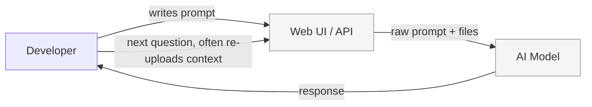
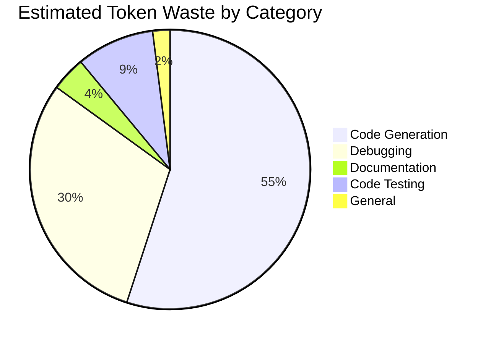
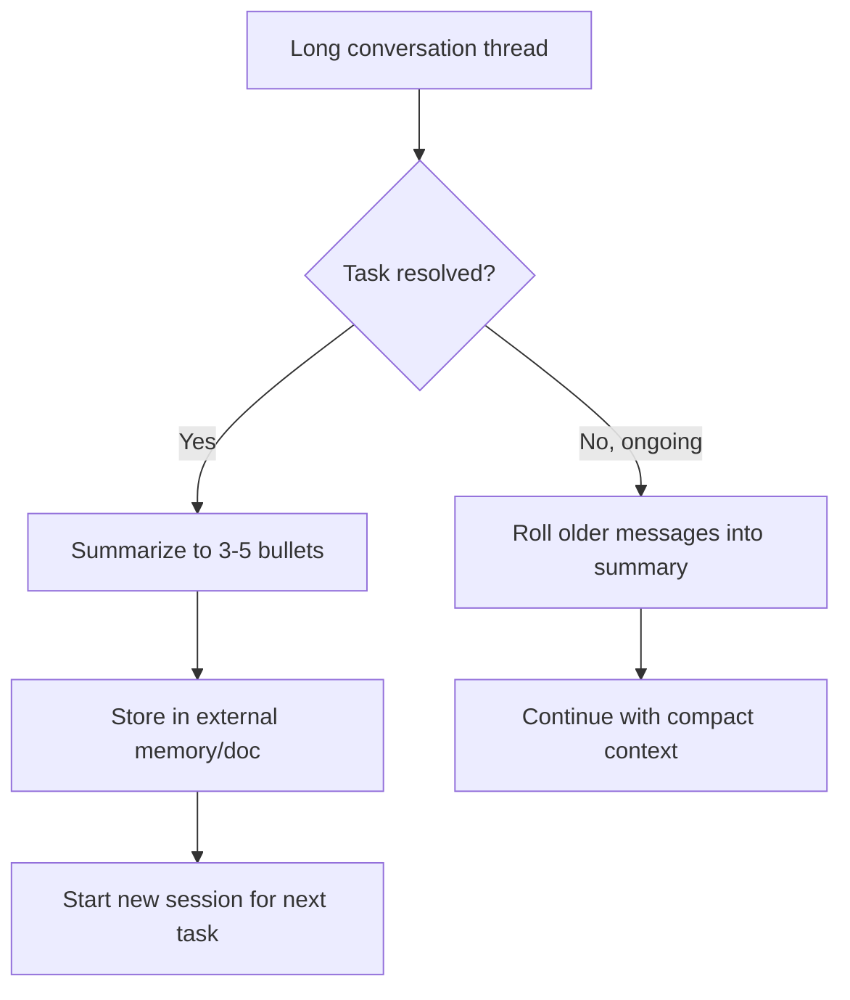
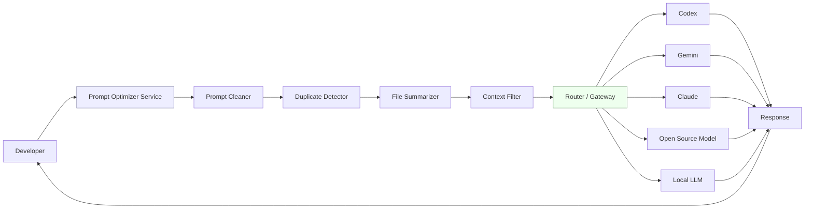
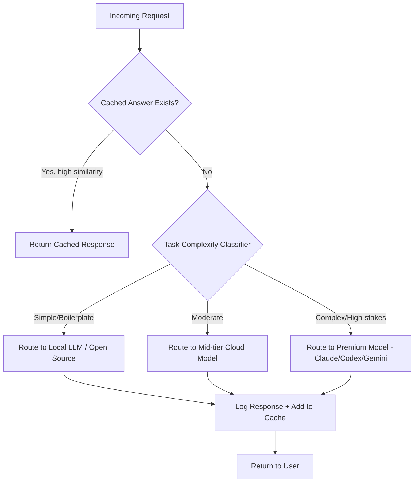

# AI Token Optimization and Cost Reduction Strategy

### Enterprise Implementation Report

This report presents practical methods to optimize AI token usage and reduce AI costs in a shared development environment.

---

---

## 1. Executive Summary

The organization has around **50 developers** sharing AI subscriptions across platforms such as **Codex, Gemini, Claude, open-source models, and local LLMs**. As a result, daily token limits are frequently exhausted due to repeated project context, unnecessary file uploads, duplicate requests, long conversations, and inefficient prompting.

This report presents practical techniques to optimize AI token usage and reduce AI costs without affecting developer productivity. The proposed approach includes better prompting practices, efficient context and file management, a Prompt Optimizer, an AI Gateway for intelligent routing and caching, and the use of open-source and local AI models for routine tasks.

By implementing these solutions, the organization can significantly reduce unnecessary token usage, minimize daily token exhaustion, and improve overall AI efficiency. The focus is not on adding new AI capabilities, but on using existing AI resources more effectively.

---

## 2. Problem Statement

The organization funds a shared pool of AI subscriptions used across ~50 developers for software development tasks — primarily code generation and debugging, with documentation, code testing, and general assistance making up the rest. Three symptoms define the current situation:

1. **Daily token/usage limits are hit routinely**- which stops developers mid-task and forces them to wait, switch tools, or copy-paste work into a personal account.
2. **AI cost per unit of useful output is high**- because a large share of tokens spent aren't advancing the task, they're re-explaining context, re-uploading files, or repeating work someone else already did.
3. **There is no intermediate layer**- between a developer's raw prompt and the model. Every prompt — however bloated, however repetitive, however oversized goes straight to the most expensive available model.

The goal of this report is narrow and practical: **increase the number of productive AI requests each developer can make per day, while lowering the total cost of the shared subscription pool.** Token reduction is a means to that end, not the goal itself. A shorter prompt that produces a worse answer and needs three follow-ups is not a win.

---

## 3. Current Workflow Analysis



This flow has no intermediate step. Every request whether it is a one-line debugging question or a full-repository rewrite — takes the same direct path. Some observed patterns that make this expensive:

| Pattern | What Happens | Token Impact |
|---|---|---|
| Fresh conversation per session | Developer re-explains project context each morning | High — repeated boilerplate context |
| Whole-file / whole-repo uploads | Entire files pasted in for a one-line fix | High — 90%+ of tokens are irrelevant to the actual question |
| No shared prompt history | Two developers independently ask the AI the same architectural question | Duplicate cost, zero benefit |
| Long-running chat threads | Old messages stay in context indefinitely | Context grows linearly even after the relevant part is resolved |
| Copy-pasted stack traces with full logs | Entire CI log pasted instead of the relevant error block | High — logs can run to thousands of lines |


---

## 4. Why Tokens Are Being Wasted

Most unnecessary AI token usage happens because of a few common practices:

* **Sending the same information repeatedly** – Developers often include the same project description or upload the same files in every new chat, even when it is not needed.
* **Uploading more code than required** – Instead of sharing only the relevant function, file changes, or error, entire files or even complete repositories are uploaded.
* **Very long conversations** – Chat sessions continue for a long time without summarizing or starting a new conversation. As a result, the AI has to process the entire chat history for every new message, which uses more tokens.
* **Not reusing previous answers** – Different developers often ask the same or very similar questions, but the AI generates a new response every time instead of using an existing solution.
* **Unclear and lengthy prompts** – Prompts are often written without a clear structure, specific instructions, or expected output format. This leads to longer responses and multiple follow-up questions, increasing token usage.
* **Using powerful AI models for simple tasks** – Large and expensive AI models are sometimes used for basic tasks like fixing syntax errors, generating simple code, or writing comments, even though smaller or local models can perform these tasks efficiently.

These problems can be solved without complex tools or major changes. By following better prompting practices, improving file sharing, choosing the right AI model, and adopting simple team guidelines, organizations can significantly reduce token usage and AI costs.


---

## 5. Token Consumption Analysis

Based on the stated usage distribution (Code Generation 55%, Debugging 30%, remainder Documentation/Review/General), here is an estimated breakdown of *where* tokens go within each category — this is the diagnostic view that justifies where optimization effort should be spent first.




---

## 6. Root Causes

| Root Cause | Description | Downstream Effect |
|---|---|---|
| No prompt standards | No team-wide guidance on how to structure a request | Every developer reinvents prompting, inconsistent quality and cost |
| No context lifecycle | Conversations never get summarized or closed out | Context grows unbounded, later messages cost more than earlier ones |
| No file discipline | "Just upload the whole file/folder" is the default habit | Massive irrelevant context per request |
| Shared account, no visibility | Nobody can see who/what is consuming the token pool | No accountability, no data to optimize against |
| No model routing | One model tier used for all task types | Expensive capability spent on cheap problems |
| No reuse layer | Every answer is generated fresh even if asked before | Duplicate spend across a 50-person team |

---

## 7. Model, Platform, and Open-Source Usage Suggestions

| Task Type | Recommended First Choice | Why |
|---|---|---|
| Deep architectural reasoning, multi-file refactors | Claude | Strong long-context reasoning, reliable at following structured instructions |
| Fast iterative code generation, autocomplete-style work | Codex | Optimized for code completion loops, fast turnaround |
| Large-context document/codebase summarization | Gemini | Very large context windows, good for ingesting big inputs |
| Boilerplate code, comment generation, simple syntax questions | Local LLM (Code Llama / StarCoder via Ollama) | Zero marginal cost, no reason to spend cloud tokens |
| Repeated/templated tasks (unit test scaffolding, docstrings) | Open-source model via internal Gateway | Cheap, consistent, cacheable |
| Sensitive/proprietary code review | Local LLM or self-hosted open-source | Avoids sending proprietary code externally at all |

---

## 8. Enterprise Token Optimization Techniques

### 8.1 Prompt Optimization

**Removing unnecessary context -**
Avoid repeating project details that are not required for the current question. If the project information has already been shared or is included in a standard prompt template, only provide the new or relevant details needed for the current request.


**Reusable prompt templates -**
Maintain a shared repository (e.g., a `prompts/` folder in a central Git repo) of templates for recurring tasks like: bug-fix request, code review request, new-feature scaffold, documentation update. 

Example:

```
Bug Fix Template
Role: Senior Python developer
Context: 1-2 line description, not full file
Error: exact error message only
Relevant code: only the failing function/block
Constraint: Do not modify unrelated code. Return only the changed function.
```


**Role prompting -**
Assigning a role ("You are a senior backend engineer reviewing for security issues") narrows the model's response scope and reduces meandering, over-broad answers that then require follow-up clarification.

**Context separation -**
Separate *stable* context (project conventions, tech stack, style guide) from *task-specific* context (this bug, this feature). Stable context should live in a template or system prompt, not be retyped per request.

**Prompt compression -**
Strip comments, whitespace, and unrelated code before pasting a snippet. Summarize long background explanations into 2-3 sentences instead of paragraphs.

**Response-length control -**
Explicitly instruct: "Return only the modified function," "Answer in under 100 words," "No explanation needed, code only." This alone often cuts response tokens by 40%+ on iterative coding tasks.

| Technique | Token Savings | Difficulty | Effort to Adopt |
|---|---|---|---|
| Prompt templates | 20–35% | Low | 1 week |
| Role prompting | 5–10% | Low | Immediate |
| Context separation | 15–25% | Medium | 2–3 weeks (needs template repo) |
| Prompt compression | 10–20% | Low | Immediate |
| Response-length control | 15–40% | Low | Immediate |

### 8.2 Context Management

**Conversation summarization -**
At the end of a working session, summarize the resolved thread into 3–5 bullet points and start the next session from that summary instead of the full history.

**Rolling summaries -**
For long-running threads (a multi-day feature build), periodically replace older messages with a compact summary of decisions made so far, keeping only the last few exchanges verbatim.

**External memory -**
Store durable project facts (architecture decisions, coding conventions, API contracts) in a plain document or wiki that gets referenced by *link or short excerpt*, not pasted whole into every conversation.

**Retrieval instead of full chat history -**
For teams with access to RAG-capable tools, index project docs/code once and retrieve only the relevant chunks per query instead of keeping everything in the live context window.

**Session reset strategy -**
Set a team norm: reset the conversation once a task is resolved. Don't let one thread drift across five unrelated tasks — each new unrelated task should start clean.



### 8.3 File Optimization

- **Avoid uploading entire repositories,** Upload only the files directly relevant to the task.
- **Upload only changed files**, not the full module, when iterating on a fix.
- **Send diffs**, not full before/after files, when asking the AI to review or continue work: `git diff` output is far cheaper than two full file pastes.
- **Chunking** — for large files, split into logical sections (functions/classes) and process independently rather than sending 2,000-line files at once.
- **Indexing** — for repositories used repeatedly, maintain a lightweight index (file purpose summaries) so a developer can point the AI at "the auth module, see `auth_index.md`" instead of pasting code to establish orientation.
- **Repository summarization** — generate a one-time `REPO_SUMMARY.md` and reuse it as a context anchor across sessions instead of re-deriving it from raw code each time.


### 8.4 Shared Account Optimization

| Technique | Description |
|---|---|
| Scheduling heavy requests | Large refactors/full-repo analysis scheduled during low-usage hours (early morning, evening) to avoid contributing to peak-hour cap exhaustion |
| Usage policies | Simple written guidance: what's an appropriate single request vs. what should be broken into smaller ones |
| Request prioritization | Debugging blockers > active feature work > exploratory/nice-to-have questions, when near the daily cap |
| Department-wise allocation | Soft quotas per team so one team's heavy usage doesn't starve another's |
| Token monitoring dashboard | Visibility into who/what is consuming the pool (see Section 13) |
| Preventing duplicate AI work | Shared answer log (even a simple searchable channel/doc) so a question already answered isn't re-asked from scratch |

### 8.5 Code Generation Optimization

- **Generate module by module** rather than asking for an entire application or large feature in one shot — smaller generations are easier to verify and cheaper to iterate on.
- **Iterative coding** — build a skeleton first, then fill in details in follow-up turns instead of one giant prompt trying to specify everything up front.
- **Reusable snippets** — maintain a snippet library for common patterns (error handling wrappers, API client boilerplate) so the AI isn't regenerating the same utility code repeatedly across the team.
- **AI-assisted refactoring** — point the AI at the diff needed, not a full-file rewrite request, when only part of a file needs to change.
- **Incremental generation** — for large features, generate interface/contract first, validate, then generate implementation, rather than one large speculative generation that's likely to need major rework.

### 8.6 Debugging Optimization

This category has the highest waste percentage and the easiest fix:

- **Provide only error logs**, not entire console/CI output — extract the relevant stack trace or error block.
- **Minimal reproducible examples** — reduce the failing case to the smallest code that reproduces it before asking the AI, rather than pasting the full file where the bug lives.
- **Selective code sharing** — share only the function(s) implicated by the stack trace, not the surrounding file.
- **Stack trace optimization** — trim framework-internal frames and keep only the frames pointing to project code.


### 8.7 Documentation Optimization

- **Incremental documentation** — update only the changed sections instead of regenerating full documents.
- **Document summarization** — for large existing docs, summarize once and reuse the summary as context for future doc updates.
- **Template reuse** — standard doc templates (API reference, README sections, changelog entries) so the AI fills a known structure instead of inventing one each time.

### 8.8 Code Review Optimization

- **Review changed lines only** — never paste the full file for a review; the diff *is* the review target.
- **Git diff review** — `git diff` output directly into the prompt, with a short note on what the change is trying to achieve.
- **Pull request summaries** — for larger PRs, generate a summary once and use it to scope which files actually need AI-assisted review, rather than reviewing everything uniformly.


---

## 9. Intermediate Prompt Optimizer — Architecture
One of the most effective long-term solutions is to implement a lightweight service that sits between developers and AI platforms, automatically optimizing every request before it reaches the AI model.




**Pipeline stages:**

1. **Prompt cleaning** — strip redundant whitespace, boilerplate greetings, repeated instructions already covered by a system template.
2. **Duplicate removal** — check a lightweight cache/embedding index for near-identical prior requests (team-wide, not just per-user) and surface the existing answer before generating a new one.
3. **File summarization** — for uploaded files above a size threshold, auto-generate a summary or extract only the referenced function/section instead of forwarding the full file.
4. **Context filtering** — drop conversation history beyond a relevance window; keep only what's needed for the current task.
5. **Routing** — hand the cleaned, minimal prompt to the Gateway, which picks the appropriate model tier.


**Implementation roadmap for this component:**

| Phase | Scope | |
|---|---|---|
| Phase 1 | Prompt cleaning + response-length enforcement (simple middleware, regex/rule-based) |
| Phase 2 | File summarization for uploads over a size threshold | 
| Phase 3 | Duplicate detection via embedding similarity search on a shared prompt log | 
| Phase 4 | Full context filtering + rolling summarization, integrated with Gateway routing | 

The system can be developed step by step using a lightweight internal proxy service, such as FastAPI or Node.js middleware. It requires minimal initial effort, and each phase can improve AI token usage and reduce costs.


---

## 10. AI Gateway Concept

While the **Prompt Optimizer** improves and cleans individual AI requests, the AI Gateway manages all AI requests and models at the organization level, ensuring efficient routing, resource utilization, and overall cost optimization.




**Core Gateway capabilities:**

- **Response caching** — store answers to common/templated queries (e.g., "generate a unit test for a getter/setter", "explain this error code") and serve cached results for near-duplicate future requests.
- **Reuse of previous answers** — team-wide cache so one developer's already-solved question benefits everyone, not just that individual's own history.
- **Duplicate request prevention** — detect when two developers submit functionally identical prompts within a short window and serve one response.
- **Distribution across models** — route by task type and complexity per Section 7's routing table.
- **Automatic cheaper-model selection** — a complexity classifier (can start as simple heuristics: prompt length, presence of "explain," "generate boilerplate," etc.) picks the cheapest model capable of the task.
- **Enterprise cost reduction** — centralizing routing means cost optimization happens once, systemically, rather than depending on every developer individually making the right choice every time.

Gateway can be built on existing open-source proxy frameworks (e.g., LiteLLM, or a custom lightweight reverse proxy) rather than from scratch.

---

## 11. Open Source Alternatives

For simple development tasks such as generating boilerplate code, making basic code changes, writing comments or documentation, and creating unit test templates, internally hosted open-source AI models can be used instead of cloud-based models. This removes additional token costs for these tasks while reducing dependence on paid AI services.

| Model | Coding Ability | Hardware Requirement | Deployment Complexity | Best Fit |
|---|---|---|---|---|
| DeepSeek Coder | Strong, competitive with mid-tier commercial models | 16–24GB VRAM (7B–33B variants) | Medium | General code generation, debugging assistance |
| Qwen2.5-Coder | Very strong, good multi-language support | 16–48GB VRAM depending on size | Medium | Code generation, code review |
| Llama 3.x | Good general reasoning, decent coding | 16GB+ VRAM (8B), more for larger variants | Low–Medium | General assistance, documentation |
| Mistral / Mixtral | Fast, efficient, good general purpose | 12–24GB VRAM | Low | Lightweight general tasks, summarization |
| Code Llama | Purpose-built for code | 16–32GB VRAM | Medium | Code completion, boilerplate |
| StarCoder2 | Strong on code completion benchmarks | 16–24GB VRAM | Medium | Autocomplete-style generation |
| Phi-3/Phi-4 | Small, surprisingly capable for size | 8–16GB VRAM, can run on CPU (slow) | Low | Lightweight tasks on modest hardware |
| Gemma 2 | Solid general performance, efficient | 8–16GB VRAM | Low | General assistance, documentation |

**Comparison summary:**

| Factor | Cloud Models (Codex/Claude/Gemini) | Open Source (Local) |
|---|---|---|
| Marginal cost per request | Subscription/token cost | ~$0 after hardware investment |
| Peak capability | Higher, especially for complex reasoning | Lower, closing gap steadily |
| Data privacy | Data leaves the org  | Stays entirely internal |
| Setup effort | None — already available | Requires GPU provisioning + deployment |
| Best use | Complex reasoning, architecture, high-stakes review | High-volume routine work |

**Recommendation:** Deploy one or two open-source AI models, such as Qwen2.5-Coder for coding tasks and Llama 3 for general assistance, on the organization's existing high-performance machines. Configure the AI Gateway to automatically route routine and high-volume requests to these local models, reducing cloud AI usage, token consumption, and overall costs.


---

## 12. Local LLM Deployment

| Tool | Purpose | Notes |
|---|---|---|
| **Ollama** | Simplest way to run local models; CLI + API, model library built in | Best starting point — minimal setup, good for individual developer machines or a shared server |
| **LM Studio** | GUI-based local model runner | Good for developers less comfortable with CLI tooling |
| **vLLM** | High-throughput serving engine for production-grade local deployment | Best for a shared team server handling many concurrent requests efficiently |
| **Open WebUI** | Chat-style web interface on top of Ollama/vLLM backends | Gives developers a familiar ChatGPT-like UI for local models, easing adoption |

**Why local deployment reduces cloud usage:** Every request processed by a local AI model reduces the number of requests sent to paid cloud AI services, helping save tokens and lower subscription costs. Since the organization already has high-performance machines, these local models can be deployed with minimal additional infrastructure cost. By routing simple and repetitive tasks—such as boilerplate code generation, basic debugging, and documentation—to local models, the organization can potentially reduce cloud AI token usage by **20–30%** while maintaining good output quality for these types of tasks.

**Suggested minimal setup:**
1. Install Ollama on one or two shared high-end machines.
2. Pull 2–3 models covering code (Qwen2.5-Coder or DeepSeek Coder) and general use (Llama 3).
3. Front it with Open WebUI so developers have a familiar interface.
4. Add these endpoints to the Gateway's routing table as the "simple/boilerplate" tier.

---

## 13. Monitoring & Dashboards

To optimize anything, usage must first be visible. Recommended metrics to track and their sources:

| Metric | Source | Suggested Tool |
|---|---|---|
| Token usage per user/team | API logs, Gateway logs | Grafana + Prometheus, or a simple logging DB |
| Cost per platform (Codex/Gemini/Claude/Open Source) | Billing exports + Gateway routing logs | Spreadsheet initially, dashboard later |
| Model usage distribution | Gateway routing decisions | Grafana dashboard |
| Department/team usage | Tagged requests via Gateway | Grafana, filterable by team tag |


**Recommended stack (free/open-source):**
- **Logging:** structured JSON logs from the Gateway/Prompt Optimizer, shipped to a simple database (PostgreSQL is sufficient at this scale).
- **Visualization:** Use **Grafana** to create dashboards for monitoring AI usage. The dashboard can collect data from **Prometheus** (which stores time-based performance metrics) or directly from the organization's logging database. This allows teams to track token usage, AI requests, costs, and system performance in one place.

- **Alerting:** simple threshold alerts (e.g., "team X at 80% of daily quota") via Grafana alerting or a Slack webhook.

This does not require an enterprise observability platform — a single small VM running Postgres + Grafana is sufficient for a 50-person team.

---

## 14. Cost Reduction Strategy (Timeline)

### Immediate Actions (Week 1)
- Publish prompt templates and a one-page "how to prompt efficiently" guide.
- Team-wide rule: paste diffs/error excerpts, not full files/logs.
- Add response-length instructions to default prompting habits.
- **Expected impact:** 15–25% reduction in wasted tokens, near-zero engineering cost.

### Short-Term Improvements (Month 1)
- Deploy Ollama + 2 open-source models on existing high-end machines.
- Stand up basic usage logging (even manual export from platform dashboards).
- Introduce session-reset and summarization habits team-wide.
- **Expected impact:** additional 15–20% reduction; daily cap exhaustion becomes rare.

### Medium-Term Improvements (Month 3)
- Build and deploy Phase 1–2 of the Prompt Optimizer (cleaning + file summarization).
- Stand up the Gateway with basic caching and rule-based routing.
- Deploy Grafana monitoring dashboard.
- **Expected impact:** additional 15–25% reduction; visible cost data available for further tuning.

### Long-Term Enterprise Strategy (6–12 Months)
- Full Prompt Optimizer (duplicate detection, rolling context management).
- Gateway with intelligent complexity-based routing and team-wide response caching.
- Expanded local/open-source model coverage for a larger share of routine tasks.
- Formal department-wise quota and reporting system.
- **Expected impact:** cumulative 40–55% total reduction in wasted token spend versus current baseline, with daily-cap exhaustion effectively eliminated under normal usage.


---

## 15. Risks & Mitigation

| Risk | Impact | Mitigation |
|---|---|---|
| Developers bypass templates/optimizer out of habit | Reduced effectiveness of the whole strategy | Make the optimizer transparent/invisible where possible; keep templates genuinely faster to use than the old way |
| Local models produce lower-quality output, eroding trust | Reduced adoption of local/open-source routing | Route only well-suited task types locally; keep an easy escalation path to cloud models |
| Caching returns stale/incorrect answers | Bugs from outdated cached code suggestions | Cache invalidation tied to file/context hashes; short TTL on code-related cache entries |
| Gateway becomes a single point of failure | Blocks all AI access if it goes down | Fallback: direct-to-platform access path retained as backup |
| Monitoring seen as surveillance, causing pushback | Team resistance, low buy-in | Frame and use monitoring at team/aggregate level, not individual policing; be transparent about what's tracked and why |
| Underestimating engineering time for Prompt Optimizer/Gateway | Delayed savings, lost momentum | Ship in the phased increments described in Section 9 and 15; each phase delivers value independently |


---

## 16. Final Recommendations

Prioritized by impact vs. effort:

**a. Highest impact, lowest effort :**
1. Debugging optimization habits (error excerpts, not full logs) 
2. Prompt templates + response-length control 
3. File/diff discipline

**b. High impact, moderate effort :**

4. Local LLM deployment via Ollama for routine tasks
5. Basic usage monitoring/dashboard
6. Session reset and summarization habits

**c. High impact, higher effort, longer payoff :**

7. Prompt Optimizer service (phased) 
8. AI Gateway with caching and routing
9. Department-wise quotas and formal reporting 

Fastest return on investment: The implementation can be carried out in phases. 
**Steps 1–3** require little to no development effort and can be introduced immediately through a simple internal guideline. 
**Steps 4–6** require moderate DevOps work and can be implemented using the organization's existing hardware. 
**Steps 7–9** are long-term solutions that establish a scalable AI platform and should be implemented as a dedicated internal project after gathering sufficient usage data from the earlier phases to optimize request routing and caching.


---

## 17. Free Tool Recommendations

| Need | Free/Open-Source Tool |
|---|---|
| Local model serving | Ollama, vLLM |
| Local model UI | Open WebUI, LM Studio |
| Gateway/routing proxy base | LiteLLM (open-source LLM proxy/router) |
| Monitoring/dashboards | Grafana + Prometheus |
| Logging database | PostgreSQL |
| Diff generation | Git (native `git diff`) |
| Prompt template storage | Plain Git repository (`prompts/` folder) |
| Alerting | Grafana Alerting, Slack webhooks |

---

